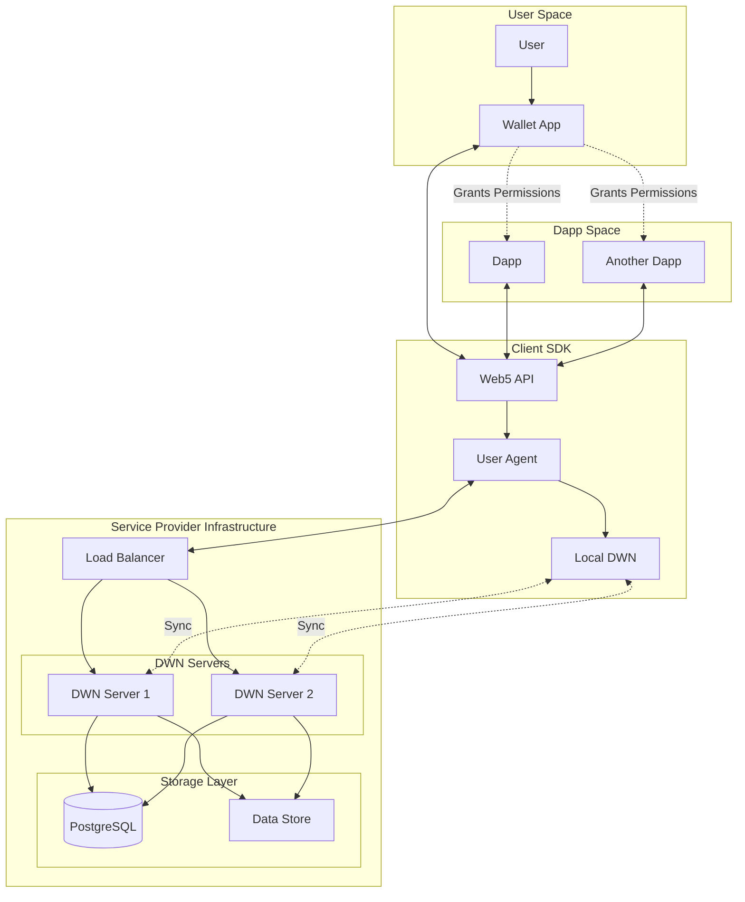

# Enbox DWN System Architecture

## Overview

Enbox is a decentralized web node (DWN) system that enables users to maintain control over their personal data while interacting with decentralized applications (dapps). The architecture supports multi-tenant personal data stores, decentralized identity management, and fine-grained permission controls.

## Core Concepts

### Decentralized Web Nodes (DWN)
- **Multi-tenant personal data stores** that service providers run using `dwn-server`
- Users can subscribe to multiple service providers or run their own DWN server
- Each DWN acts as a personal data vault with protocol-based access control

### User Experience
1. **Wallet**: Users have a wallet application (e.g., web-wallet example) to manage their identity and data
2. **Identity Management**: Each user has a decentralized identifier (DID) that represents their identity
3. **Data Sovereignty**: Users control where their data is stored and who can access it
4. **Permission Grants**: Users explicitly grant permissions to dapps to access specific data

### Developer Experience
1. **Protocol Definitions**: Developers define protocols that describe data schemas and access patterns
2. **Permission Requests**: Dapps request permissions from users through a standardized flow
3. **Data Operations**: Standard CRUD operations on records with protocol-based filtering
4. **Real-time Subscriptions**: Subscribe to data changes through event streams

## System Architecture

### Core Packages

#### 1. `@enbox/dwn-sdk-js` (Core Business Logic)
**Responsibilities:**
- Core DWN implementation with message handling
- Protocol configuration and validation
- Record storage and retrieval
- Event streaming and subscriptions
- Permission enforcement

**Key Components:**
- `Dwn`: Main orchestrator for all DWN operations
- Method Handlers: Process different types of messages (Records, Protocols, Messages)
- Storage Controller: Manages data persistence across stores
- Tenant Gate: Controls access to multi-tenant DWN instances

#### 2. `@enbox/dwn-server` (Multi-tenant Server)
**Responsibilities:**
- HTTP/WebSocket API endpoints
- Multi-tenant request routing
- Registration management for new tenants
- Server lifecycle management

**Key Features:**
- RESTful HTTP API for DWN operations
- WebSocket support for real-time subscriptions
- Configurable storage backends
- Plugin system for extensibility

#### 3. `@enbox/api` (Client SDK)
**Responsibilities:**
- High-level API for dapp developers
- Web5 connection management
- Simplified interfaces for DWN operations
- Wallet connection flow

**Key APIs:**
- `Web5.connect()`: Establishes connection to user's DWN
- `DwnApi`: Interface for records, protocols, and permissions
- `DidApi`: DID resolution and management
- `VcApi`: Verifiable credentials operations

#### 4. `@enbox/agent` (Identity & Permission Management)
**Responsibilities:**
- Identity management and key storage
- Permission grant creation and validation
- DWN request processing and routing
- Cryptographic operations

**Key Components:**
- `Web5Agent`: Core agent interface
- `PermissionsApi`: Permission grant/request/revocation
- `IdentityApi`: Identity creation and management
- `KeyManager`: Cryptographic key management

#### 5. Storage Packages
- **`@enbox/dwn-sql-store`**: SQL-based implementations of MessageStore, DataStore, and EventLog
- **PostgreSQL**: Default production database for persistence

#### 6. Supporting Packages
- **`@enbox/dids`**: DID method implementations and resolution
- **`@enbox/crypto`**: Cryptographic primitives and JOSE operations
- **`@enbox/common`**: Shared utilities and types

### Data Flow

#### 1. Initial Connection Flow
```
User → Wallet → Web5.connect() → Agent → DWN Server
                                    ↓
                              Create/Load DID
                                    ↓
                              Establish Session
```

#### 2. Permission Request Flow
```
Dapp → Request Permissions → Wallet → User Approval
                                ↓
                          Grant Creation
                                ↓
                          Store in DWN
                                ↓
                    Return to Dapp with Access
```

#### 3. Data Operation Flow
```
Dapp → DwnApi → Agent → Process Request
                   ↓
            Validate Permissions
                   ↓
            Route to DWN
                   ↓
        Execute Operation
                   ↓
         Return Response
```

#### 4. Sync Flow
```
Local Agent ← → Sync Manager ← → Remote DWN(s)
     ↓               ↓                ↓
Local Store    Conflict Res.    Remote Store
```

## Service Interaction Diagram



## Key Architectural Patterns

### 1. Protocol-Based Data Model
- All data is organized by protocols that define schemas and access patterns
- Protocols enable semantic interoperability between dapps
- Each protocol defines roles, record types, and actions

### 2. Permission-Based Access Control
- Fine-grained permissions at the protocol and record level
- Delegated permissions allow dapps to act on behalf of users
- Revocable grants ensure users maintain control

### 3. Multi-Tenant Architecture
- Single DWN server instance can host multiple user tenants
- Tenant isolation ensures data privacy
- Efficient resource utilization for service providers

### 4. Event-Driven Architecture
- Event streams enable real-time subscriptions
- Event log provides audit trail and sync capabilities
- Resumable tasks ensure reliability

### 5. Cryptographic Security
- All messages are signed with user's DID keys
- Optional encryption for sensitive data
- Verifiable data integrity

## Developer Workflow

### 1. Define Protocol
```typescript
const protocolDefinition = {
  protocol: "https://example.com/protocol",
  published: true,
  types: {
    task: {
      dataFormats: ["application/json"],
      schema: "https://example.com/schemas/task"
    }
  },
  structure: {
    task: {
      $tags: {
        $requiredTags: ["status"],
        status: { type: "string" }
      }
    }
  }
};
```

### 2. Connect to User's DWN
```typescript
const { web5, did } = await Web5.connect({
  walletConnectOptions: {
    displayName: "My Dapp",
    permissionRequests: [{
      protocolDefinition,
      permissions: ["read", "write"]
    }]
  }
});
```

### 3. Interact with Data
```typescript
// Write data
const { record } = await web5.dwn.records.create({
  data: { title: "My Task", status: "pending" },
  message: {
    protocol: protocolDefinition.protocol,
    protocolPath: "task",
    dataFormat: "application/json"
  }
});

// Query data
const { records } = await web5.dwn.records.query({
  message: {
    filter: {
      protocol: protocolDefinition.protocol,
      protocolPath: "task",
      tags: { status: "pending" }
    }
  }
});
```

## Security Considerations

1. **Identity Security**: Private keys stored in encrypted vaults
2. **Transport Security**: TLS for all network communications
3. **Data Security**: Encryption at rest and in transit
4. **Access Control**: Cryptographic verification of all permissions
5. **Audit Trail**: Complete event log of all operations

## Deployment Architecture

### Development
- Docker Compose for local development
- In-memory stores for testing
- Hot reload support

### Production
- Kubernetes or Railway for orchestration
- PostgreSQL for data persistence
- Redis for caching and sessions
- CDN for static assets
- Load balancing for high availability

## Scalability Considerations

1. **Horizontal Scaling**: DWN servers are stateless and can be scaled out
2. **Database Sharding**: Tenant-based sharding for large deployments
3. **Caching**: Multiple cache layers for performance
4. **Event Streaming**: Kafka or similar for high-volume event processing
5. **Storage Tiering**: Hot/cold storage based on access patterns

## Summary

The Enbox DWN architecture provides a robust foundation for decentralized applications that respect user sovereignty while enabling rich functionality. The modular design allows developers to build sophisticated applications while users maintain control over their personal data stores. The multi-tenant architecture enables efficient service provider operations while maintaining strong isolation between users.