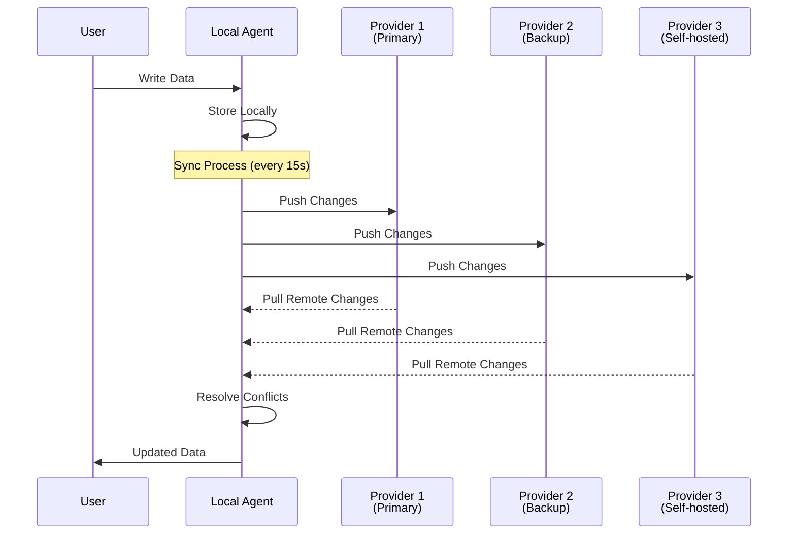
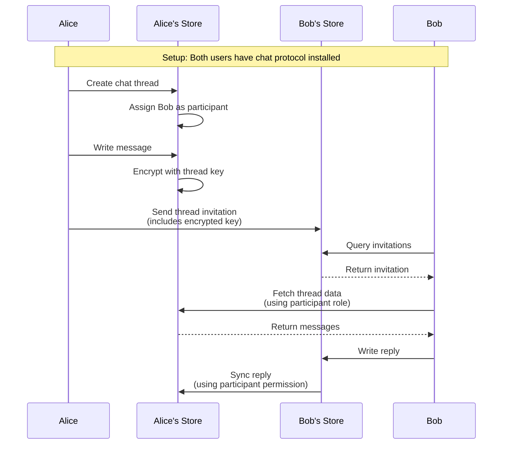
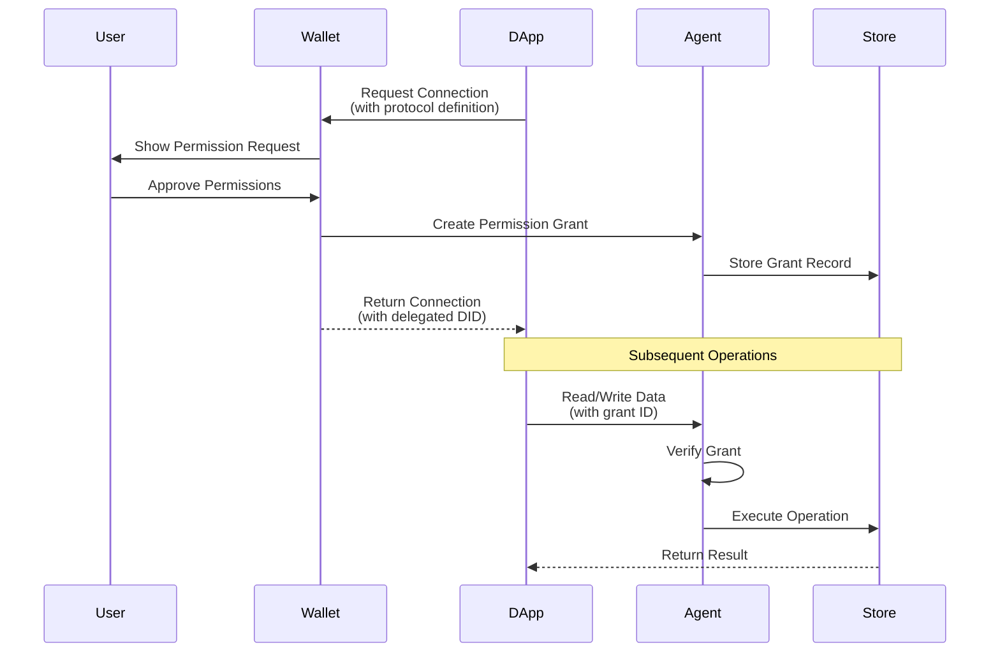
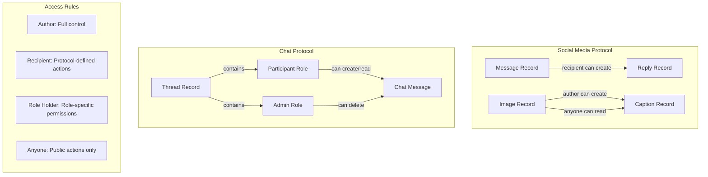
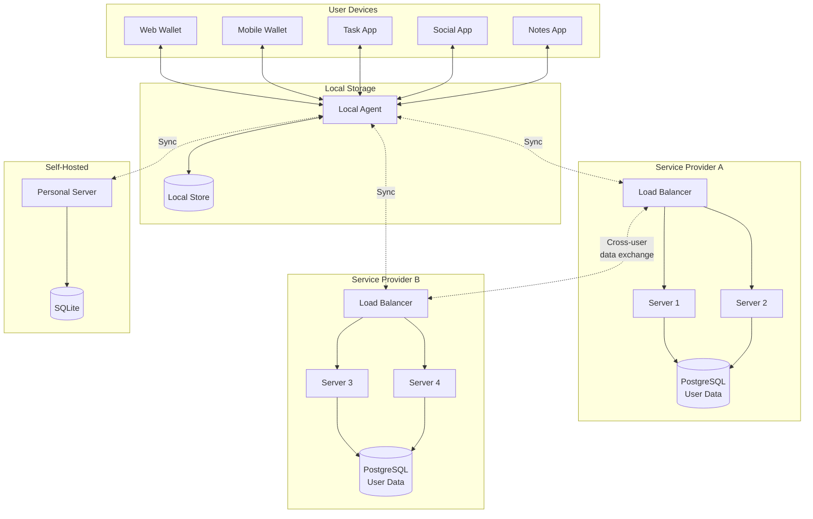

# Personal Data Store Architecture

## Overview

This system enables users to own and control their personal data through distributed personal data stores. Users maintain sovereignty over their data while enabling rich multi-user interactions through a protocol-based permission system. The architecture supports true data portability - users can use multiple service providers or self-host their data stores.

## Core Concepts

### Personal Data Stores
- **Multi-tenant data stores** where each user's data is isolated and encrypted
- Users can have their data replicated across multiple service providers
- Automatic synchronization ensures data consistency across providers
- Each store maintains complete audit logs and event streams

### User Identity & Control
1. **Digital Wallet**: A specialized application that manages user identity and cryptographic keys
2. **Decentralized Identifiers (DIDs)**: Cryptographically verifiable identities independent of any service provider
3. **Data Sovereignty**: Users retain ownership and can move data between providers
4. **Permission Management**: Fine-grained control over who can access what data

### Application Development Model
1. **Protocol-Based Data Schemas**: Applications define structured data models with built-in access rules
2. **Permission Requests**: Applications request specific data access from users
3. **Cross-User Interactions**: Protocols enable secure data sharing between users
4. **Real-time Updates**: Applications can subscribe to data changes

## System Architecture

### Core Components

#### 1. Personal Data Store SDK (Core Business Logic)
**Purpose**: Implements the data store logic, message processing, and access control

**Key Responsibilities:**
- Message validation and processing (Records, Protocols, Permissions)
- Protocol-based access control enforcement
- Data persistence across multiple storage backends
- Event streaming for real-time updates
- Cryptographic verification of all operations

**Core Subsystems:**
- **Message Handlers**: Process different operation types (create, read, update, delete, query, subscribe)
- **Protocol Engine**: Validates data against protocol definitions and enforces access rules
- **Storage Controller**: Abstracts storage operations across message store, data store, and event log
- **Tenant Gate**: Ensures data isolation in multi-tenant deployments

#### 2. Personal Data Store Server (Multi-tenant Infrastructure)
**Purpose**: Provides network-accessible personal data stores for multiple users

**Key Features:**
- HTTP API for synchronous operations
- WebSocket support for real-time subscriptions
- Multi-tenant request routing and isolation
- Optional user registration and terms of service
- Pluggable storage backends (PostgreSQL, SQLite, etc.)

#### 3. Application SDK (Developer Interface)
**Purpose**: High-level APIs for building applications that interact with personal data stores

**Key APIs:**
- **Connection Management**: Establish secure connections to user's data stores
- **Data Operations**: Simplified CRUD operations with automatic permission handling
- **Protocol Management**: Install and configure data protocols
- **Identity Resolution**: Resolve and verify user identities

#### 4. Identity & Permission Agent
**Purpose**: Manages user identities, keys, and permission grants

**Core Functions:**
- **Identity Vault**: Secure storage of cryptographic keys
- **Permission Negotiation**: Handle permission requests and grants between apps and users
- **Delegation**: Enable applications to act on behalf of users
- **Sync Orchestration**: Coordinate data synchronization across multiple providers

### Data Flow Patterns

#### 1. Multi-Provider Sync Flow


#### 2. Cross-User Data Sharing Flow


#### 3. Application Permission Flow


### Protocol-Based Permissions

Protocols define both data schemas and access rules. Here's how multi-user permissions work:



### Example Protocol Definition

```typescript
{
  protocol: "https://example.com/protocols/task-manager",
  published: true,
  types: {
    list: {
      schema: "https://example.com/schemas/task-list",
      dataFormats: ["application/json"]
    },
    task: {
      schema: "https://example.com/schemas/task",
      dataFormats: ["application/json"]
    },
    collaborator: {}
  },
  structure: {
    list: {
      $actions: [
        {
          who: "author",
          can: ["create", "update", "delete"]
        }
      ],
      collaborator: {
        $role: true,
        $actions: [
          {
            role: "list/collaborator",
            can: ["create", "update"]
          }
        ]
      },
      task: {
        $actions: [
          {
            who: "author",
            of: "list",
            can: ["create", "update", "delete"]
          },
          {
            role: "list/collaborator",
            can: ["create", "update"]
          },
          {
            who: "recipient",
            of: "task",
            can: ["update"]
          }
        ]
      }
    }
  }
}
```

### System Deployment Architecture



## Multi-User Interaction Patterns

### 1. Direct Messaging
Users can send messages directly to other users' stores:
- Sender writes a record with `recipient` field set to receiver's DID
- Receiver's store accepts the message based on protocol rules
- No central server required for message routing

### 2. Shared Workspaces
Multiple users collaborate on shared data:
- Creator establishes a workspace record
- Creator assigns roles (admin, editor, viewer) to other users
- Role holders can perform actions defined in the protocol
- All changes sync to all participants' stores

### 3. Social Interactions
Public and private social features:
- Public posts: Anyone can read, specific users can comment
- Private groups: Only members can read and write
- Reactions: Recipients of content can add reactions
- Moderation: Content owners and admins can remove content

### 4. Delegated Actions
Applications acting on behalf of users:
- User grants specific permissions to an application
- Application receives a delegated DID for signing operations
- All actions are traceable back to the authorizing user
- Permissions can be revoked at any time

## Security Architecture

### Cryptographic Foundation
- **Identity**: Ed25519 keys for DID authentication
- **Signatures**: Every message is signed by its author
- **Encryption**: Optional end-to-end encryption for sensitive data
- **Integrity**: Content-addressed storage ensures data hasn't been tampered with

### Access Control Layers
1. **Transport**: TLS encryption for all network communication
2. **Authentication**: DID-based authentication for all requests
3. **Authorization**: Protocol rules determine allowed actions
4. **Delegation**: Scoped permissions for third-party access
5. **Audit**: Complete log of all operations

### Data Privacy
- **Isolation**: Each user's data is cryptographically separated
- **Encryption at Rest**: Optional encryption of stored data
- **Selective Disclosure**: Users control what data to share
- **Right to Delete**: Users can permanently remove their data

## Developer Experience

### Building a Collaborative App

```typescript
// 1. Define your protocol
const taskProtocol = {
  protocol: "https://myapp.com/protocols/tasks",
  types: {
    project: { schema: "...", dataFormats: ["application/json"] },
    task: { schema: "...", dataFormats: ["application/json"] },
    member: {}
  },
  structure: {
    project: {
      member: {
        $role: true,
        $actions: [{ role: "project/member", can: ["create", "read", "update"] }]
      },
      task: {
        $actions: [
          { who: "author", of: "project", can: ["create", "update", "delete"] },
          { role: "project/member", can: ["create", "update"] },
          { who: "recipient", of: "task", can: ["update"] }
        ]
      }
    }
  }
};

// 2. Connect to user's personal data store
const { web5, did } = await Web5.connect({
  walletConnectOptions: {
    displayName: "Task Manager Pro",
    permissionRequests: [{
      protocolDefinition: taskProtocol,
      permissions: ["read", "write", "delete"]
    }]
  }
});

// 3. Create a project and invite collaborators
const { record: project } = await web5.dwn.records.create({
  data: { name: "Q4 Planning", description: "..." },
  message: {
    protocol: taskProtocol.protocol,
    protocolPath: "project",
    dataFormat: "application/json"
  }
});

// 4. Add team members
await web5.dwn.records.create({
  data: { did: "did:example:alice", name: "Alice" },
  message: {
    protocol: taskProtocol.protocol,
    protocolPath: "project/member",
    parentContextId: project.contextId,
    dataFormat: "application/json"
  }
});

// 5. Create a task assigned to Alice
await web5.dwn.records.create({
  data: { 
    title: "Review Q3 metrics",
    assignee: "did:example:alice",
    status: "pending"
  },
  message: {
    protocol: taskProtocol.protocol,
    protocolPath: "project/task",
    parentContextId: project.contextId,
    recipient: "did:example:alice",  // Alice can now update this task
    dataFormat: "application/json"
  }
});

// 6. Subscribe to real-time updates
await web5.dwn.records.subscribe({
  message: {
    filter: {
      protocol: taskProtocol.protocol,
      protocolPath: "project/task"
    }
  },
  handler: (record) => {
    console.log("Task updated:", record);
  }
});
```

## Summary

This architecture enables a new model of application development where:
- Users truly own their data across multiple providers
- Applications are permission-based views into user data
- Multi-user collaboration happens through cryptographically secure protocols
- No vendor lock-in - users can switch providers while keeping their data
- Privacy and security are built-in, not added on

The personal data store model represents a fundamental shift from application-centric to user-centric data architecture, enabling true data portability and user sovereignty while maintaining the rich features users expect from modern applications.