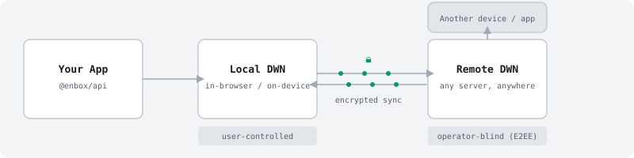

<p align="center">
  <picture>
    <source media="(prefers-color-scheme: dark)" srcset="./assets/enbox-mark-dark.svg">
    
  </picture>
</p>

<h1 align="center">en<strong>b</strong>ox</h1>

<p align="center">
  <strong>The decentralized backend for web apps.</strong>
</p>

<p align="center">
  <a href="https://github.com/enboxorg/enbox/actions/workflows/ci.yml"></a>
  <a href="./LICENSE"></a>
  <a href="https://bun.sh"></a>
  <a href="https://www.npmjs.com/package/@enbox/api"></a>
</p>

> [!CAUTION]
> **Research Preview -- Not Production Ready**
>
> Enbox is under active development. APIs may break, preview DWN servers may be
> wiped, and the code has not been externally audited. Do not store sensitive or
> irreplaceable data yet. We are not accepting external contributions while the
> core APIs are still changing.

## What Enbox Provides

Enbox is a Bun/TypeScript monorepo for building apps on
[Decentralized Web Nodes](https://identity.foundation/decentralized-web-node/spec/)
(DWNs). It includes:

- A high-level app SDK with typed protocols, record operations, and DID helpers.
- A headless auth layer for local vaults, wallet connect, session restore, and sync startup.
- An agent runtime with encrypted identity/key stores and live/durable DWN sync.
- A self-hostable DWN server with HTTP/WebSocket APIs and SQL-backed persistence.
- Shared DID, crypto, protocol, browser, CLI, and codegen packages.

The model is protocol-first: apps define portable record schemas and access
rules, users control their DIDs and DWN endpoints, and encrypted data can move
between apps that understand the same protocol.

## Quick Start

```bash
bun add @enbox/api
```

```ts
import {
  createConnectionStore,
  defineApplicationManifest,
  defineProtocol,
  recordCodecs,
} from '@enbox/api';

const BookmarkProtocol = defineProtocol({
  protocol  : 'https://example.com/bookmarks',
  published : false,
  types     : {
    bookmark: {
      schema             : 'https://example.com/schemas/bookmark',
      dataFormats        : ['application/json'],
      encryptionRequired : true,
    },
  },
  structure: {
    bookmark: {
      $tags: { category: { type: 'string' } },
    },
  },
} as const, {
  bookmark: recordCodecs.json<{ url: string; title: string; note?: string }>(),
});

const application = defineApplicationManifest({
  protocols: [BookmarkProtocol],
} as const);

const store = createConnectionStore({
  application,
  password     : userPassword,
  dwnEndpoints : ['https://enbox-dwn.fly.dev'],
});

let snapshot = await store.initialize();
if (snapshot.phase === 'disconnected') {
  snapshot = await store.connectVault({ createIdentity: true });
}
if (snapshot.phase !== 'connected') {
  throw snapshot.error ?? new Error('Connection was not established.');
}

const bookmarks = snapshot.enbox.using(BookmarkProtocol);

const record = await bookmarks.records.create('bookmark', {
  data : { url: 'https://example.com', title: 'Example' },
  tags : { category: 'reading' },
});

const { records } = await bookmarks.records.query('bookmark', {
  filter: { tags: { category: 'reading' } },
});

console.log(snapshot.session.did, record.id, records.length);

await store.disconnect();
await store.dispose();
```

Create one connection store for the application/data path and retain it for the
application lifetime. Separate stores intentionally do not coordinate.

For browser apps, `@enbox/browser` re-exports the main app APIs and adds
browser-specific connect helpers and DRL polyfills.
For terminal tools, `@enbox/cli` provides the same app APIs with a relay/PIN
connect handler that prints a QR code or opens the wallet approval link.

See [packages/api/README.md](./packages/api/README.md) and the
[public docs site](https://enbox-docs.pages.dev) for more examples.

## Runtime Model

<picture>
  <source media="(prefers-color-scheme: dark)" srcset="./assets/dwn-flow-dark.svg">
  
</picture>

1. The app talks to an Enbox agent and local DWN.
2. The agent signs DWN messages with the active DID.
3. Sync pushes/pulls records to remote DWN servers over HTTP/WebSocket.
4. Other devices and authorized apps converge through the same remote DWN feed.

Encryption has two layers: the local vault protects identity material, and
protocol types with `encryptionRequired: true` encrypt record data at the DWN
layer using the tenant's key agreement key.

## DWN Servers

Use the preview endpoints only for development:

| Node | URL | Notes |
|---|---|---|
| Fly.io | `https://enbox-dwn.fly.dev` | SQLite-backed preview node |
| AWS | `https://dev.aws.dwn.enbox.id` | Aurora PostgreSQL preview node |

Run your own node with `@enbox/dwn-server`:

```bash
git clone https://github.com/enboxorg/enbox.git
cd enbox
docker compose up dwn-server
```

See [docs/HOSTING.md](./docs/HOSTING.md) and
[packages/dwn-server/README.md](./packages/dwn-server/README.md) for hosting
configuration, storage backends, and registration options.

## Packages

| Package | Role |
|---|---|
| [`@enbox/api`](./packages/api) | High-level SDK: connection lifecycle, typed protocols, and records |
| [`@enbox/auth`](./packages/auth) | Headless auth, local vault connect, wallet connect, session restore |
| [`@enbox/browser`](./packages/browser) | Browser helpers and polyfills |
| [`@enbox/cli`](./packages/cli) | CLI helpers and relay/PIN wallet connect handler |
| [`@enbox/protocols`](./packages/protocols) | Shared protocol definitions and JSON Schemas |
| [`@enbox/protocol-codegen`](./packages/protocol-codegen) | TypeScript generation from protocol definitions and schemas |
| [`@enbox/agent`](./packages/agent) | Identity vault, key management, local DWN, sync engine |
| [`@enbox/dids`](./packages/dids) | DID creation and resolution |
| [`@enbox/crypto`](./packages/crypto) | Crypto primitives, JWE, local key management |
| [`@enbox/common`](./packages/common) | Shared utilities and storage helpers |
| [`@enbox/dwn-sdk-js`](./packages/dwn-sdk-js) | Core DWN engine and message handlers |
| [`@enbox/dwn-clients`](./packages/dwn-clients) | DWN HTTP/WebSocket clients and registration client |
| [`@enbox/dwn-server`](./packages/dwn-server) | Multi-tenant DWN server |
| [`@enbox/dwn-sql-store`](./packages/dwn-sql-store) | SQL-backed DWN storage |

`@enbox/dwn-relay` lives in a separate repository:
<https://github.com/enboxorg/dwn-relay>.

## Development

```bash
bun install
bun run build
bun run lint
```

Several test suites require Docker services and a local Pkarr relay:

```bash
docker compose -f docker-compose.test.yaml up -d --wait
export DID_DHT_GATEWAY_URI=http://localhost:7527
export DID_DHT_ALLOW_PRIVATE_GATEWAY=1
bun run test:node
```

See [AGENTS.md](./AGENTS.md) for contributor workflow, style, release, and CI
rules. See [docs/TESTING.md](./docs/TESTING.md) for local service setup and the
coverage pipeline.

## Security

Do not open public issues for vulnerabilities. Email
[security@enboxorg.com](mailto:security@enboxorg.com) with details.

## License

[Apache-2.0](./LICENSE)

## Resources

- [Documentation](https://enbox-docs.pages.dev)
- [DWN Specification](https://identity.foundation/decentralized-web-node/spec/)
- [DID Core Specification](https://www.w3.org/TR/did-core/)

<sub>This monorepo consolidates packages from the [decentralized-identity](https://github.com/decentralized-identity) organization, including [dwn-sdk-js](https://github.com/decentralized-identity/dwn-sdk-js), [dwn-server](https://github.com/decentralized-identity/dwn-server), [dwn-sql-store](https://github.com/decentralized-identity/dwn-sql-store), and the web5-js monorepo.</sub>
