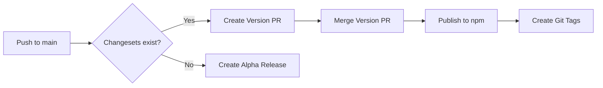

# Enbox

A comprehensive toolkit for decentralized identity and data management.

## 🏗️ **Architecture Overview**

This monorepo contains the following packages under the `@enbox` namespace:

### Core DWN (Decentralized Web Node) Packages
- **`@enbox/dwn-sdk-js`** - Core DWN SDK implementation (client/server compatible)
- **`@enbox/dwn-sql-store`** - SQL-backed implementations of DWN MessageStore, DataStore, and EventLog
- **`@enbox/dwn-server`** - Express.js server implementation for DWN

### SDK Packages
- **`@enbox/api`** - Main API entry point for building decentralized applications
- **`@enbox/agent`** - Agent implementation for decentralized identity management
- **`@enbox/identity-agent`** - Identity agent for credential management
- **`@enbox/user-agent`** - User agent for decentralized applications
- **`@enbox/proxy-agent`** - Proxy agent for secure communication
- **`@enbox/common`** - Shared utilities and common functionality
- **`@enbox/crypto`** - Cryptographic library and JOSE implementation
- **`@enbox/crypto-aws-kms`** - AWS KMS integration for cryptography
- **`@enbox/dids`** - Decentralized Identifiers (DID) library
- **`@enbox/credentials`** - Verifiable Credentials implementation
- **`@enbox/browser`** - Browser-specific tools and features

## 🔄 **System Flow**

The system is designed to work as follows:

1. **Server Setup**: Run `@enbox/dwn-server` connected to a SQL database
2. **Client Integration**: Import `@enbox/api` in frontend applications
3. **Communication**: The API uses `@enbox/dwn-sdk-js` + agents to communicate with the DWN server

## 🚀 **Quick Start**

### Prerequisites
- Node.js >= 18
- pnpm

### Installation
```bash
# Clone the repository
git clone https://github.com/enboxorg/enbox.git
cd enbox

# Install dependencies
pnpm install

# Build all packages
pnpm build
```

## 📦 **Managing Releases with Changesets**

This monorepo uses [Changesets](https://github.com/changesets/changesets) to manage versioning and publishing of packages. Changesets automate the process of versioning, changelog generation, and releasing packages to npm.

### How Changesets Work

1. **Creating Changesets**: When you make changes to any package(s), create a changeset describing what changed
2. **Version Updates**: Changesets automatically determine version bumps based on the type of change
3. **Changelog Generation**: Changelogs are automatically generated from changeset descriptions
4. **Publishing**: All packages are published together in a coordinated release

### Creating a Changeset

After making changes to one or more packages:

```bash
# Create a new changeset
pnpm changeset

# This will prompt you to:
# 1. Select which packages have changed
# 2. Choose the type of change (major/minor/patch)
# 3. Write a summary of the changes
```

### Changeset Types

- **Major**: Breaking changes (e.g., removing APIs, changing function signatures)
- **Minor**: New features that don't break existing functionality
- **Patch**: Bug fixes and small improvements

### Example Workflow

```bash
# 1. Make your changes to packages
# 2. Create a changeset
pnpm changeset

# 3. Commit the changeset file along with your changes
git add .
git commit -m "feat: add new feature to @enbox/api"

# 4. Push to your branch and create a PR
git push origin feature-branch
```

### Releasing Packages (Maintainers)

```bash
# 1. Check current changeset status
pnpm changeset:status

# 2. Update versions based on changesets
pnpm version

# 3. Review the version bumps and changelogs
# 4. Commit the version updates
git add .
git commit -m "chore: version packages"

# 5. Build and publish all packages
pnpm release

# 6. Push tags and commits
git push --follow-tags
```

### Best Practices

1. **Always create a changeset** when modifying public APIs or fixing bugs
2. **Write clear changeset descriptions** - these become your changelog entries
3. **Group related changes** in a single changeset when they affect multiple packages
4. **Don't commit generated files** - version updates are handled during release

### Changeset File Example

Changesets are stored in `.changeset/` as markdown files:

```markdown
---
"@enbox/api": minor
"@enbox/agent": patch
---

Added new authentication method to API and fixed related issue in agent
```

### CI/CD Integration

For automated releases, you can use the Changesets GitHub Action:

1. It creates a PR with all version updates when changesets are merged
2. Merging the PR triggers automatic publishing to npm
3. Tags are created for each published version

#### GitHub Actions Setup

The repository includes a release workflow (`.github/workflows/release.yml`) that:

1. **Runs on push to main**: Triggers when changes are merged
2. **Creates Version PRs**: Automatically creates PRs with version updates
3. **Publishes to npm**: When version PRs are merged, packages are published
4. **Generates prereleases**: Creates alpha versions for testing

#### Required Secrets

Add these secrets to your GitHub repository:

- `NPM_TOKEN`: npm authentication token with publish permissions
- `GITHUB_TOKEN`: Automatically provided by GitHub Actions

#### Workflow Process



### Common Commands

```bash
# Create a changeset
pnpm changeset

# Add a changeset with specific packages (skip prompts)
pnpm changeset add --packages @enbox/api,@enbox/agent

# Check what will be released
pnpm changeset:status

# Version packages (without publishing)
pnpm version

# Build and publish packages
pnpm release
```

### Troubleshooting

- **No changesets found**: Run `pnpm changeset` to create one
- **Version conflicts**: Ensure `pnpm install` runs after version updates
- **Publishing fails**: Check npm authentication and package access rights

## 🐳 **Docker Setup**

The easiest way to get started with the DWN server is using Docker Compose, which sets up both the DWN server and PostgreSQL database.

### Quick Start with Docker
```bash
# Start the DWN server with PostgreSQL
docker-compose up -d

# View logs
docker-compose logs -f dwn-server

# Stop services
docker-compose down
```

The DWN server will be available at `http://localhost:3000` with the following endpoints:
- `/info` - Server information
- `/` - DWN protocol endpoints

### Customizing the Setup
Copy `docker.env.example` to `.env` and customize the configuration:
```bash
cp docker.env.example .env
# Edit .env with your preferred settings
```

### Data Persistence
Both PostgreSQL data and DWN data are persisted in Docker volumes:
- `postgres_data` - PostgreSQL database files (accessible on port 5433)
- `dwn_data` - DWN server data files

### Port Configuration
- **DWN Server**: `http://localhost:3000`
- **PostgreSQL**: `localhost:5433` (avoids conflicts with package-level testing)

### Production Considerations
For production deployments:
1. Change default passwords in `.env`
2. Use external PostgreSQL service for better scalability
3. Set up SSL/TLS termination (reverse proxy)
4. Configure backup strategies
5. Set resource limits for containers

## 🚄 **Railway Deployment**

Deploy the DWN server to Railway (Platform-as-a-Service) with managed PostgreSQL in minutes:

### Setup
See the complete [Railway Deployment Guide](./RAILWAY.md) for detailed instructions.

**Quick summary:**
1. Fork this repository
2. Connect to Railway and create project from your fork
3. Add PostgreSQL database service
4. Configure environment variables
5. Deploy automatically

### Railway Benefits
- ✅ **Managed PostgreSQL** with automatic backups
- ✅ **Auto-scaling** based on traffic  
- ✅ **SSL certificates** automatically managed
- ✅ **Git-based deployments** with instant rollbacks
- ✅ **Environment management** (staging/production)
- ✅ **Monitoring & logs** built-in

For complete Railway deployment instructions, troubleshooting, and production tips, see **[RAILWAY.md](./RAILWAY.md)**.

### Development
```bash
# Run tests
pnpm test:node

# Lint code
pnpm lint
pnpm lint:fix

# Clean build artifacts
pnpm clean
```

## 📦 **Package Dependencies**

### Internal Dependencies
- `@enbox/dwn-sql-store` depends on `@enbox/dwn-sdk-js`
- `@enbox/dwn-server` depends on `@enbox/dwn-sdk-js` and `@enbox/dwn-sql-store`
- `@enbox/api` depends on `@enbox/agent`, `@enbox/common`, `@enbox/crypto`, `@enbox/dids`, `@enbox/user-agent`
- `@enbox/agent` depends on `@enbox/dwn-sdk-js`, `@enbox/common`, `@enbox/crypto`, `@enbox/dids`
- All packages use workspace dependencies for internal packages

## 📁 **Repository Structure**

```
enbox/
├── package.json              # Root monorepo configuration
├── pnpm-workspace.yaml      # Workspace configuration
├── tsconfig.json            # TypeScript configuration
├── eslint.config.cjs        # ESLint configuration
├── README.md                # This file
├── AGENT_CONTEXT.md         # AI/LLM context documentation
├── .gitignore              # Git ignore rules
└── packages/               # All packages
    ├── dwn-sdk-js/        # Core DWN SDK
    ├── dwn-sql-store/     # SQL implementations
    ├── dwn-server/        # Express server
    ├── api/               # Main API entry point
    ├── agent/             # Agent implementation
    ├── identity-agent/    # Identity agent
    ├── user-agent/        # User agent
    ├── proxy-agent/       # Proxy agent
    ├── common/            # Shared utilities
    ├── crypto/            # Cryptographic library
    ├── crypto-aws-kms/    # AWS KMS integration
    ├── dids/              # DID library
    ├── credentials/       # Verifiable credentials
    └── browser/           # Browser tools
```

## 🤝 **Contributing**

This repository consolidates packages from the decentralized identity ecosystem. For detailed contribution guidelines, see the original repositories:

- [dwn-sdk-js Contributing](https://github.com/decentralized-identity/dwn-sdk-js/blob/main/CONTRIBUTING.md)
- [decentralized-identity Contributing](https://github.com/decentralized-identity/web5-js/blob/main/CONTRIBUTING.md)

## 📄 **License**

MIT

## 🔗 **Related Resources**

- [Decentralized Web Node Specification](https://identity.foundation/decentralized-web-node/spec/)
- [DID Specification](https://www.w3.org/TR/did-core/)

---

*This monorepo consolidates packages from the [decentralized-identity](https://github.com/decentralized-identity) organization, including [dwn-sdk-js](https://github.com/decentralized-identity/dwn-sdk-js), [dwn-server](https://github.com/decentralized-identity/dwn-server), [dwn-sql-store](https://github.com/decentralized-identity/dwn-sql-store), and the web5-js monorepo.*