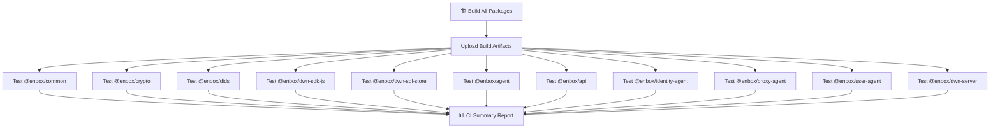

# CI Workflow Structure

## Overview

The CI workflow uses a parallelized structure for efficient testing:

## How It Works

1. **Build Phase**: 
   - Builds all packages once
   - Handles native dependencies (like better-sqlite3)
   - Uploads artifacts for reuse

2. **Test Phase** (runs in parallel):
   - Each package has its own test job
   - Tests run concurrently for speed
   - Each test job shows clear pass/fail status
   - Failed tests show detailed output

3. **Summary Phase**:
   - Creates a comprehensive test report
   - Shows which specific packages failed
   - Provides a clear overview of CI status

## GitHub Actions UI

In the GitHub Actions UI, you'll see:

- **Workflow visualization**: Shows all jobs and their dependencies
- **Job list**: Each test job is clearly labeled (e.g., "Test @enbox/agent")
- **Status indicators**: ✅ for passed, ❌ for failed, ⏱️ for running
- **Summary report**: Click on "CI Summary" job to see the full test report

## Test Result Visibility Features

1. **Job Summaries**: Each test job creates a summary with:
   - Pass/fail status
   - Failed test details (if any)
   - Test output logs

2. **Artifacts**: Test results are uploaded as artifacts for debugging

3. **Grouping**: Test output is grouped for better readability

4. **Final Report**: The CI Summary job creates a table showing all test results