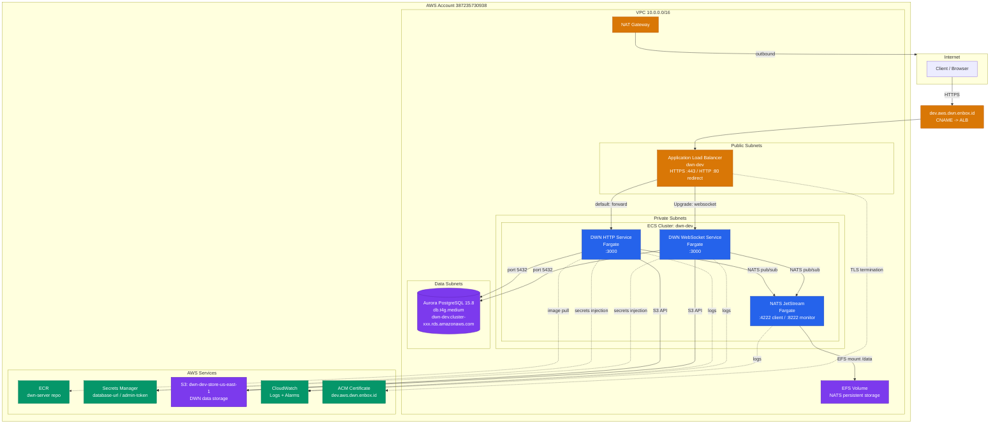

# Dev Environment Architecture

## Key Details

| Component | Details |
|---|---|
| **ALB** | Internet-facing, TLS 1.3, HTTP->HTTPS redirect, WebSocket routing via `Upgrade` header |
| **DWN HTTP** | Fargate, 512 CPU / 1024 MB, autoscaling 1-2 tasks |
| **DWN WebSocket** | Fargate, 512 CPU / 1024 MB, autoscaling 1-2 tasks |
| **NATS** | Single-node JetStream, EFS-backed persistence, CloudMap service discovery (`nats-0.nats.local`) |
| **Aurora** | PostgreSQL 15.8 Serverless-compatible, `db.t4g.medium`, encrypted, managed master password |
| **S3** | `dwn-dev-store-us-east-1`, SSE-S3 encryption, restricted bucket policy |
| **Secrets** | `dwn/dev/database-url` (Postgres connection string), `dwn/dev/admin-token` (bearer token) |
| **Monitoring** | CloudWatch alarms for ALB 5xx, ALB latency P95, ECS CPU/memory, Aurora CPU |
