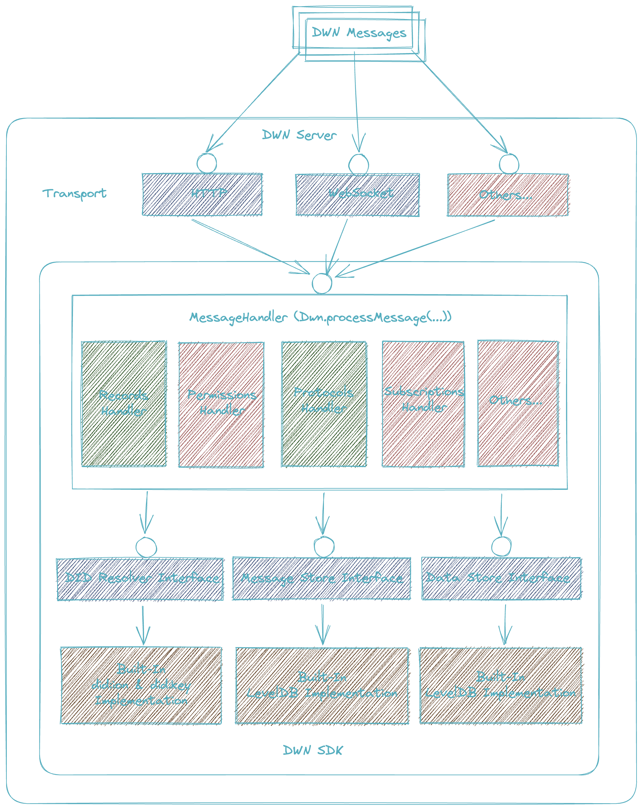

# Decentralized Web Node (DWN) SDK

> **Research Preview** — Enbox is under active development. APIs may change without notice.

[](https://github.com/enboxorg/enbox/actions/workflows/ci.yml)

A TypeScript implementation of [Decentralized Web Nodes](https://identity.foundation/decentralized-web-node/spec/) — protocol-driven personal datastores that users control.

## Overview

This package is the core DWN engine used by the rest of the Enbox stack. It handles message processing, protocol authorization, record storage, and encryption. Most applications should use [`@enbox/api`](../api/) rather than this package directly.

## Installation

```bash
bun add @enbox/dwn-sdk-js
```

## Usage

```ts
import { Dwn, DataStream, Jws, RecordsWrite } from '@enbox/dwn-sdk-js';
import { DataStoreLevel, MessageStoreLevel, ResumableTaskStoreLevel } from '@enbox/dwn-sdk-js/stores/level';

const messageStore = new MessageStoreLevel();
const dataStore = new DataStoreLevel();
const resumableTaskStore = new ResumableTaskStoreLevel();
const dwn = await Dwn.create({ messageStore, dataStore, resumableTaskStore });

// Create and process a RecordsWrite message
const data = new TextEncoder().encode('Hello, World!');
const recordsWrite = await RecordsWrite.create({
  data,
  dataFormat  : 'application/json',
  published   : true,
  schema      : 'example/post',
  signer      : Jws.createSigner(persona),
});

const dataStream = DataStream.fromBytes(data);
const result = await dwn.processMessage(persona.did, recordsWrite.message, { dataStream });
console.log(result.status); // { code: 202, detail: 'Accepted' }

await dwn.close();
```

Level-backed store implementations are exported from `@enbox/dwn-sdk-js/stores/level` so applications that only need message and protocol APIs do not load the Level store module graph by default. Shared blockstore helpers used by alternative store implementations are available from `@enbox/dwn-sdk-js/stores/blockstore`.

### Custom Tenant Gating

By default all DIDs are allowed as tenants. Provide a custom `TenantGate` to restrict access:

```ts
import { ActiveTenantCheckResult, Dwn, TenantGate } from '@enbox/dwn-sdk-js';

class CustomTenantGate implements TenantGate {
  public async isActiveTenant(did: string): Promise<ActiveTenantCheckResult> {
    // custom logic
  }
}

const dwn = await Dwn.create({ messageStore, dataStore, resumableTaskStore, tenantGate: new CustomTenantGate() });
```

### Custom Signer

Use `PrivateKeySigner` if you have a key available, or implement the `Signer` interface to integrate with an external signing service, HSM, etc.:

```ts
import type { Signer } from '@enbox/dwn-sdk-js';

class CustomSigner implements Signer {
  public keyId = 'did:example:alice#key1';
  public algorithm = 'EdDSA';
  public async sign(content: Uint8Array): Promise<Uint8Array> {
    // custom signing logic
  }
}
```

## Architecture



> The diagram is a conceptual view; actual component names in source may differ.

## Development

```bash
# Build
bun run build

# Test
bun run test:node

# Test with grep filter (from this package directory)
GREP="ProtocolsConfigure" bun run test:node-grep

# Lint
bun run lint
```

## License

Apache-2.0
